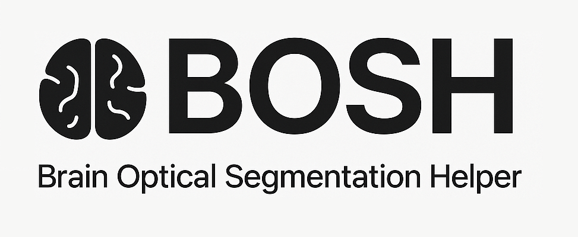

<p align="center">
  
</p>

Brain Optical Segmentation Helper (BOSH) is a collection of Open Neural Network Exchange (ONNX) segmentation models trained for MRI-based segmentation tasks.

---

## 🧠 Model Catalogue

| Status | Example | Model Name                         | Params (10⁶) | Size (MB) | Axis  | Weighting | Function |
|------------------------------------|--------------:|-----------:|-------|-----------|--------------------|--------|----------|
| 🟢  |  | `bosh.resnet18.axial.smri.t2_se.seg.brain.fp32.v1.0.0.onnx`     | 14.3          | 54.6      | Axial | T2-SE       | Brain segmentation |


> 🟢 Implemented 🔵 In Development ⚪ Planned

## 📚 Citation

If you use BOSH in your research or tool, please cite it using the following:

```bibtex
@software{bass2026bosh,
  author       = {Bass, Leon},
  title        = {BOSH: Brain Optical Segmentation Helper},
  month        = feb,
  year         = 2026,
  publisher    = {Zenodo},
  version      = {v1.0.0},
  doi          = {xxxxxx/zenodo.xxxxxxxx},
  url          = {https://doi.org/xxxxxxxx/zenodo.xxxxxx}
}
```
